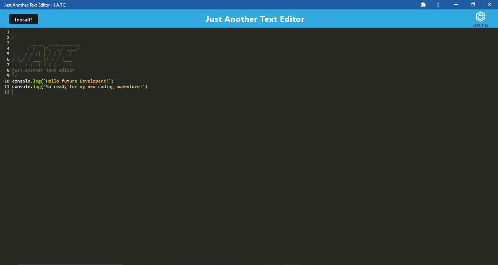

# PWA-Text-Editor

  
  
    
## [Table of Contents](#table-of-contents)

- [Description](#description)
- [Installation](#installation)
- [Usage](#usage)
- [Contributing](#contributing)
- [Test](#test)
- [License](#license)
- [Questions](#questions)

## [Description](#table-of-contents)

Building a text editor website application, that will run in the browser and also will function offline, by using Express.js, nodemon & concurrently Devdependecies, and the required webpack dependencies to meet the PWA criteria. This single-page application also can be installed to a computer.

## [Installation](#table-of-contents)
    
To install this single-page application:

* Clone the repository's code
* Open it in VS Code, choose and open the terminal of your preference
* Install the required packages, dependencies and Devdependencies (Express, nodemon, concurrently, webpack, etc) by running "npm install"

## [Usage](#table-of-contents)
    
To use this application:
* Run the command "npm run start dev" to start the appplication
* open the assigned localhost PORT in the browser

To use this application, please follow the next link [TextEditor]()

The following image shows how the Text-Editor web application will look like:

    
## [Contributing](#table-of-contents)

  Thanks! But I am not accepting foreign contributions at the moment.

## [Test](#table-of-contents)

N/A

## [License](#table-of-contents)

    Copyright (C) 2023 Cristhian Bustamante

   Permission is hereby granted, free of charge, to any person obtaining a copy of this software and associated documentation files (the "Software"), to deal in the Software without restriction, including without limitation the rights to use, copy, modify, merge, publish, distribute, sublicense, and/or sell copies of the Software, and to permit persons to whom the Software is furnished to do so, subject to the following conditions:

   The above copyright notice and this permission notice shall be included in all copies or substantial portions of the Software.

   THE SOFTWARE IS PROVIDED "AS IS", WITHOUT WARRANTY OF ANY KIND, EXPRESS OR IMPLIED, INCLUDING BUT NOT LIMITED TO THE WARRANTIES OF MERCHANTABILITY, FITNESS FOR A PARTICULAR PURPOSE AND NONINFRINGEMENT. IN NO EVENT SHALL THE AUTHORS OR COPYRIGHT HOLDERS BE LIABLE FOR ANY CLAIM, DAMAGES OR OTHER LIABILITY, WHETHER IN AN ACTION OF CONTRACT, TORT OR OTHERWISE, ARISING FROM, OUT OF OR IN CONNECTION WITH THE SOFTWARE OR THE USE OR OTHER DEALINGS IN THE SOFTWARE.       
   
   https://opensource.org/licenses/MIT
        
## [Questions](#table-of-contents)

- You can reach me through https://github.com/Luffykun20
- Also, you can contact me through my e-mail: [cristhian_georgia_20@hotmail.com](mailto:cristhian_georgia_20@hotmail.com) if you have any question.